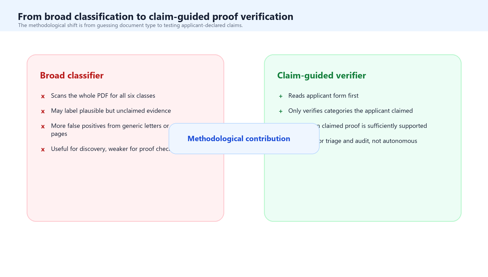

# Claim-guided document evidence verification for public-sector human-resource applications: development and evaluation of a local-first AI-assisted workflow

Draft author: Vivek Jason Jayaraj and collaborators
Draft date: 2026-05-07
Repository branch: feature/manuscript-v4-1-validation
Manuscript status: revised development-and-evaluation draft

## Abstract

### Background

Public-sector human-resource application systems often require applicants to support personal, family, health, spouse-location, disability and examination-related claims with documentary proof. This creates a recurring administrative bottleneck: reviewers must reconcile structured form declarations with heterogeneous uploaded PDFs, many of which are scanned, multilingual, multi-page and only partially relevant. Existing electronic know-your-customer and digital identity systems address adjacent problems, but usually emphasise identity proofing, biometrics, liveness detection and document authenticity rather than claim-specific administrative evidence verification. A transparent, locally deployable method for first-pass proof checking could reduce avoidable manual review while preserving auditability and human oversight.

### Objective

We aimed to develop and evaluate a local-first, claim-guided document evidence verifier for public-sector human-resource applications. The primary contribution is the method: a workflow that reads applicant-declared claims, verifies only the evidence categories that were claimed, uses optical character recognition and local vision-language model inference to inspect uploaded PDFs, and produces auditable outputs for human review.

### Methods

We designed the verifier as a modular, human-in-the-loop document AI workflow. The system ingests structured applicant data, converts relevant fields into six claim booleans, retrieves uploaded PDF evidence, extracts direct PDF text where possible, renders scanned pages, routes low-text pages through OCR, and uses a locally hosted multimodal model through an orchestration harness to verify whether claimed categories are supported by visible document evidence. The six proof categories were marriage, self illness, family illness, spouse location, OKU self or family, and MedEX or other examination evidence. Unclaimed categories were deliberately skipped to reduce false-positive labelling. The system exported final tick sheets, scoring sheets, decision queues, proof-strength fields, page references, original PDF links and evidence summaries. We evaluated the method retrospectively against a manually adjudicated reference set of 238 applicants, corresponding to 1,428 applicant-evidence decisions.

### Results

The developed verifier completed the full evidence workflow and produced auditable applicant-level outputs. In the final validation set, it produced 415 true-positive, 103 false-positive, 856 true-negative and 54 false-negative evidence-level decisions. Overall accuracy was 89.0%, sensitivity 88.5%, specificity 89.3%, positive predictive value 80.1%, negative predictive value 94.1% and F1 score 84.1%. Exact applicant-level agreement across all six categories was 118/238 (49.6%). The system routed 64/238 applicants (26.9%) for manual review, implying that 174/238 (73.1%) could be handled through a first-pass no-check stream subject to governance controls. Performance was strongest for marriage and MedEX or other examination evidence, while family illness and spouse-location proof remained the main residual error sources.

### Conclusions

This work describes the development of a claim-guided, local-first AI-assisted method for administrative document evidence verification. The key advance is not a single model, but a constrained verification harness that combines structured claims, OCR routing, local multimodal inference, deterministic proof rules and auditable review outputs. The method appears useful as first-pass triage, but not as autonomous adjudication. Deployment should therefore be framed as decision support: reducing routine review burden, improving traceability and focusing human attention on missing, ambiguous or low-confidence proof.

Keywords: document AI; human-resource applications; evidence verification; optical character recognition; vision-language model; local-first AI; human-in-the-loop; public-sector digital health

## Introduction

Human-resource application systems in large public services often depend on documentary proof. Applicants may declare that they are married, that a spouse is posted in a particular location, that they or a family member have health needs, that a disability-related consideration applies, or that a postgraduate or professional examination obligation should be considered. These claims are not merely clerical details. They can shape placement, transfer, prioritisation and review decisions. In health systems, where workforce distribution affects service access and continuity, administrative proof checking sits inside a wider policy problem: ensuring the right people are available in the right places while maintaining fair, transparent and defensible application processes [1,2].

The proof-checking task is deceptively difficult. The structured form may be clean, but the supporting evidence is rarely clean. Applicants upload scanned marriage certificates, spouse posting letters, medical appointment notes, hospital reports, OKU cards, examination slips, screenshots, multi-document bundles and sometimes irrelevant or incomplete files. A single PDF can contain several unrelated pages. Some documents have extractable text; others are image-only. Some are in English, Bahasa Malaysia or Arabic-script/Jawi-like formats; others contain names, identity numbers, handwritten annotations, stamps and seals that are visually meaningful but poorly represented by optical character recognition (OCR). In these circumstances, manual review is slow but robust. Naive automation is fast but brittle.

The central methodological problem is therefore not simply "classify a PDF". In an administrative application workflow, the task is claim-guided proof verification. The system should first ask what the applicant claimed, then inspect whether the uploaded document supports those claims. A broad classifier that labels every plausible category in a PDF can create false positives, because it may infer evidence that the applicant never declared. Conversely, a conservative text-only system can create false negatives when proof is visually obvious but OCR is poor. The verifier developed here was designed around this tension.

This paper reports the development and evaluation of a local-first AI-assisted evidence verification workflow for public-sector human-resource applications. We use "local-first" deliberately. The system was designed to run with local storage, local OCR and local language or vision-language model inference, rather than sending sensitive applicant documents to external document-processing APIs. This matters because uploaded evidence may contain family relationships, health information, disability documentation, identity numbers, workplace locations and examination records. A local-first approach does not remove governance obligations, but it reduces avoidable external data flows and supports clearer audit.

The work also sits within a broader document AI and e-KYC landscape. Commercial electronic know-your-customer systems are increasingly sophisticated, combining identity document capture, authenticity checks, face matching, liveness detection, sanctions screening and risk scoring [3-5]. However, the present use case is narrower and different. The aim is not to prove a person's identity from first principles. It is to assist human operators in verifying whether applicant-declared administrative claims are supported by uploaded evidence. This distinction is important: overclaiming full e-KYC capability would be inaccurate, while underdescribing the AI harness would miss the main methodological contribution.

We therefore frame this as a methods-development study with retrospective validation. The objective was to build an auditable, claim-guided verifier and quantify its performance as a first-pass triage system. Accuracy is reported because the method must be evaluated, but accuracy is not the sole point of the paper. The main contribution is the architecture: structured claim extraction, evidence-category skipping, OCR-aware page processing, local multimodal verification, proof-strength scoring, and operator-facing outputs that preserve human review.

## Related Work

### Administrative Evidence Verification and Workforce Applications

Public-sector workforce systems frequently balance individual circumstances against service needs. In health workforce policy, international guidance emphasises the importance of staffing distribution, rural and remote access, retention, and transparent planning mechanisms [1,2]. Much of this literature concerns allocation, retention and workforce modelling rather than document verification itself. Yet in practice, many allocation or placement systems depend on administrative evidence: a claimed family, health, disability or training circumstance must be converted into a reviewable signal before it can inform a decision.

This creates a data-quality layer that is easy to understate. If evidence review is inconsistent, slow or opaque, downstream workforce decisions may become delayed, inequitable or difficult to audit. Conversely, if automation is too aggressive, applicants may be wrongly cleared or incorrectly flagged. The relevant policy problem is therefore not only efficiency; it is accountable administrative decision support.

### Document AI, OCR and Multimodal Understanding

Traditional OCR remains a core technology for digitising scanned documents. Tesseract is one of the most widely used open-source OCR engines and has long been applied to document analysis tasks [6]. PaddleOCR and the PP-OCR family extended practical OCR toward lightweight, multilingual and production-oriented pipelines [7,8]. More recent document AI approaches use Transformer architectures to model text, layout and images jointly. TrOCR recasts OCR as an end-to-end Transformer task [9]. LayoutLMv3 uses unified text and image masking for document AI pre-training [10]. Donut removes the external OCR dependency by treating document understanding as OCR-free image-to-sequence generation [11]. GeoLayoutLM emphasises geometric pre-training for visual information extraction [12].

These methods are relevant because administrative evidence is not only text. Layout, stamps, tables, official seals, document titles, signatures and page structure can all be meaningful. The verifier described here did not train a new document foundation model. Instead, it used a pragmatic harness: OCR and deterministic signals where they were reliable, page images where OCR was weak, and a local vision-language model where visual context mattered.

### Vision-Language Models and Local Inference

Vision-language models (VLMs) are increasingly capable of interpreting documents, charts, diagrams and screenshots. Qwen2.5-VL, for example, reports strong performance on document and diagram understanding tasks and is available in model sizes compatible with local deployment on suitable hardware [13]. The local inference layer in this work was served through Ollama, which exposes a local API for running language models, including vision-capable models, on local machines [14]. Langflow was used as the visual and Python-based orchestration layer, allowing the workflow to be represented as components rather than a monolithic script [15].

The important design choice was not merely "use a VLM". Unconstrained VLM calls can hallucinate, over-label ambiguous pages, or produce unstructured text that is difficult to audit. The harness therefore constrained model use in four ways. First, the prompt supplied applicant claims and told the model to verify only claimed categories. Second, deterministic rules and OCR-derived signals shortlisted likely evidence pages. Third, model output was parsed into a fixed schema with proof status, proof strength, supporting page and evidence summary. Fourth, the system defaulted to manual review when proof was missing, ambiguous or low confidence.

### Reporting and Governance of AI Decision Support

The reporting of AI-assisted decision support should separate development, validation and deployment. DECIDE-AI emphasises early-stage evaluation of AI decision-support systems and the importance of human-in-the-loop workflows [16]. CONSORT-AI and TRIPOD+AI similarly reflect the broader movement toward transparent reporting of AI methods, settings, failure modes and human interaction [17,18]. Diagnostic accuracy reporting guidance such as STARD remains useful when an algorithmic output is compared with a reference standard [19], but it does not by itself capture workflow design, auditability or operator burden. This manuscript therefore combines a development narrative with a validation analysis.

## Methods

### Study Design

We conducted a methods-development and retrospective evaluation study. The study object was a working software method for administrative evidence verification, not a standalone predictive model. Development was iterative and operationally driven: early broad-classification prototypes were replaced by a claim-guided verifier after error review showed that broad classification created false positives and missed visually obvious evidence. The final method was then evaluated against a manually adjudicated validation set.

### Setting and Target Use Case

The target use case was a public-sector human-resource application workflow in which applicants submit structured form data and upload supporting PDFs. The setting involved people applying for placement-related consideration and submitting documentary evidence for personal, family, spouse-location, health, disability or examination-related claims. The manuscript intentionally uses generic terminology because the method is not specific to one professional discipline. The same proof-checking problem can arise in any large administrative workforce process where declared circumstances must be supported by uploaded evidence.

### Design Requirements

We defined seven implementation requirements before the final evaluation:

- The system must read applicant claims before reading the document evidence.
- The system must verify only claimed evidence categories and avoid labelling unclaimed categories as positive.
- The system must handle text PDFs and scanned image PDFs.
- The system must use page images and visual cues when OCR is weak.
- The system must run locally where feasible, including local model inference.
- The system must produce operator-facing outputs, not only machine labels.
- The system must preserve original PDF links, page references, evidence summaries and proof-strength fields for audit.

These requirements shaped the architecture more than any single model choice.

### Evidence Categories and Claim Extraction

The verifier mapped each applicant row into six boolean claims:

- claimed_marriage
- claimed_self_illness
- claimed_family_illness
- claimed_spouse_location
- claimed_oku_self_or_family
- claimed_medex_other_exam

Claim extraction used deterministic rules over normalised spreadsheet fields. For example, marital-status and spouse-related fields informed marriage and spouse-location claims; applicant health fields informed self-illness claims; spouse, child or parent health indicators informed family-illness claims; OKU-related fields informed disability claims; and postgraduate or examination fields informed MedEX or other examination claims. If a row contained contradictory or unclear structured evidence, the applicant was routed to manual review rather than silently interpreted.

The six proof categories were intentionally practical rather than ontological. They reflect administrative review needs. Marriage proof could include marriage or nikah certificates and clear spouse relationship evidence. Self-illness proof required medical evidence about the applicant. Family-illness proof required medical evidence about a spouse, child, parent or relevant family member. Spouse-location proof required evidence of spouse workplace, posting, residence or location. OKU proof required explicit OKU or disability evidence. MedEX or other examination proof required examination registration, attendance, result, certificate or official postgraduate/specialist examination documentation; generic physical examination or routine medical notes were not sufficient.

### Workflow Architecture

The implemented workflow had seven stages. First, applicant spreadsheets were ingested and mapped to canonical columns. Second, claim extraction converted structured fields into the six claim booleans. Third, supporting PDFs were acquired from original uploaded links or local cached paths. Fourth, PDFs were processed through direct text extraction and page rendering. Fifth, OCR routing selected direct PDF text where available and OCR fallback for scanned or low-text pages. Sixth, the AI harness generated claim-specific evidence signals. Finally, export writers produced decision queues, scoring sheets, final tick sheets, merged outputs and audit payloads.

### OCR and Page Processing

The OCR design followed a direct-text-first principle. If a PDF contained sufficient extractable text, the system avoided unnecessary OCR. If direct text was absent, sparse or low quality, pages were rendered as images and routed through OCR. The OCR route could use Tesseract-style extraction for standard printed text and a PaddleOCR fallback for difficult pages. Page images were retained for downstream visual inspection by the model and the human reviewer.

The system also generated page-level metadata: page number, extracted text, OCR confidence where available, image path, candidate signals and matching keywords. This metadata served two purposes. First, it reduced unnecessary model calls by shortlisting likely pages. Second, it made the final output auditable because reviewers could see why a page was considered relevant.

### AI Harness

The AI harness was the central methodological component. It was designed as a constrained verification layer rather than an unconstrained chatbot or free-form classifier. The harness included:

- Langflow-shaped orchestration to make the processing chain inspectable and modular.
- Deterministic claim extraction and skip logic for unclaimed categories.
- OCR-derived page signals including keywords, names, identity numbers and layout hints.
- Local multimodal inference through Ollama and Qwen2.5-VL for visually complex or OCR-poor pages.
- Structured prompts that explicitly instructed the model not to classify the whole PDF and not to infer unclaimed categories.
- JSON schema parsing to force outputs into proof_found, proof_strength, supporting_page, evidence_summary and confidence fields.
- A decision policy that set check_required when proof was missing, ambiguous, low confidence or affected by process failure.

This design reflects a deliberate separation of responsibilities. The spreadsheet and rules layer defines what needs to be checked. OCR and rendering define what can be read or seen. The VLM adjudicates ambiguous visual evidence within a constrained prompt. The parser and decision policy translate model output into auditable structured fields. The operator interface then displays the result with a link to the original PDF.

### Claim-Guided Verification Logic

The final method differed from earlier broad classification in one essential way. It did not ask, "What documents are in this PDF?" It asked, "For the claims this applicant declared, does the uploaded PDF contain sufficient proof?" This is a smaller and more operationally meaningful question.

If an applicant did not claim a category, the verifier did not mark that category as proof_found even if the document contained something suggestive. If an applicant did claim a category, the verifier searched for sufficient proof and produced one of three practical states: supported, missing or ambiguous. Ambiguous and low-confidence outputs were routed to manual review. This design was intended to reduce false positives from unclaimed evidence while preserving a pathway for human judgement.

### Outputs

The system produced several operator-facing artifacts:

- A final tick sheet with one row per applicant and one column per evidence class.
- A scoring sheet for manual validation and subsequent model comparison.
- A decision queue indicating check or no-check status.
- A review queue for applicants requiring manual inspection.
- Supporting-page and evidence-summary fields.
- Original PDF links for immediate click-through review.
- Proof-strength and confidence fields for each claimed category.

These outputs were designed for workflow use. The system did not merely provide labels; it provided a structured review surface that could support manual checking, quality assurance and future recalibration.

### Validation Dataset

The final validation used a manually adjudicated reference workbook. The analytic set included 238 matched applicants. Each applicant contributed six applicant-evidence decisions, producing 1,428 binary decisions. Manual adjudication defined whether each evidence category was present or absent.

### Evaluation Metrics

We calculated true positives, false positives, true negatives and false negatives at the evidence-decision level. We then estimated accuracy, sensitivity, specificity, positive predictive value (PPV), negative predictive value (NPV) and F1 score. We also calculated exact applicant-level agreement, defined as all six evidence categories matching the manual reference standard for a given applicant. The manual review rate was calculated as the proportion of applicants routed to check.

Because each applicant contributed six correlated evidence decisions, the decision-level metrics should be interpreted as descriptive rather than fully independent observations. Approximate Wilson intervals were generated in the machine-readable validation summary, but the manuscript emphasises point estimates and operational interpretation. Future work should use applicant-clustered bootstrap intervals.

### Governance and Privacy

The development workflow intentionally avoided committing raw applicant PDFs, OCR caches, local databases or applicant-level error sheets to source control. The manuscript folder contains de-identified aggregate validation outputs only. Before operational deployment or external submission, the method should be accompanied by a data protection statement, access-control model, retention policy, model-governance note and reviewer accountability process.

## Results

### Developed System Artifact

The final artifact was a local-first, claim-guided verifier that could ingest applicant data, retrieve uploaded PDFs, process text and image documents, invoke a constrained local VLM, and export audit-ready review outputs. The main development result was not a black-box model but a repeatable workflow that converted applicant-declared claims into proof-checking tasks.

The verifier operationalised six design levers:

- Claim primacy: structured applicant claims define what the system checks.
- Category skipping: unclaimed categories are not labelled as positive evidence.
- OCR-aware perception: direct text, OCR and page images are combined rather than treated as interchangeable.
- Constrained local VLM inference: the model is prompted with claim context and forced into structured outputs.
- Proof-strength adjudication: evidence is represented as strength and support, not only present or absent.
- Human-in-the-loop export: outputs are built for review, validation and recalibration.

### Validation Set and Overall Performance

The validation set included 238 applicants and 1,428 evidence-level decisions. The verifier produced 415 true positives, 103 false positives, 856 true negatives and 54 false negatives. Overall accuracy was 89.0%, sensitivity 88.5%, specificity 89.3%, PPV 80.1%, NPV 94.1% and F1 score 84.1%.

| Metric | Result |
| --- | ---: |
| Applicants matched | 238 |
| Evidence-level binary decisions | 1,428 |
| True positives | 415 |
| False positives | 103 |
| True negatives | 856 |
| False negatives | 54 |
| Accuracy | 89.0% |
| Sensitivity / recall | 88.5% |
| Specificity | 89.3% |
| PPV / precision | 80.1% |
| NPV | 94.1% |
| F1 score | 84.1% |
| Exact applicant-level matches | 118 / 238 (49.6%) |
| Applicants flagged for manual review | 64 / 238 (26.9%) |
| Applicants not flagged for manual review | 174 / 238 (73.1%) |

### Evidence-Type Performance

Performance varied by evidence category. Marriage evidence performed strongly, with sensitivity of 88.8%, specificity of 98.9%, PPV of 99.2% and F1 score of 93.7%. MedEX or other examination evidence also performed well, with sensitivity of 91.4%, specificity of 87.9% and F1 score of 85.1%. These categories have relatively distinctive document forms or vocabulary.

Family illness and spouse-location evidence were more difficult. Family illness had sensitivity of 83.9% but specificity of 69.5%, while spouse location had sensitivity of 98.1% and specificity of 75.4%. This pattern suggests that the verifier was effective at detecting possible relational evidence, but sometimes over-called documents where the relationship or purpose of the document was not sufficiently clear.

| Evidence type | Manual positives | AI positives | TP | FP | TN | FN |
| --- | ---: | ---: | ---: | ---: | ---: | ---: |
| Marriage | 143 | 128 | 127 | 1 | 94 | 16 |
| Self illness | 35 | 28 | 24 | 4 | 199 | 11 |
| Family illness | 87 | 119 | 73 | 46 | 105 | 14 |
| Spouse location | 108 | 138 | 106 | 32 | 98 | 2 |
| OKU self or family | 15 | 12 | 11 | 1 | 222 | 4 |
| MedEX or other exam | 81 | 93 | 74 | 19 | 138 | 7 |

| Evidence type | Accuracy | Sensitivity | Specificity | PPV | NPV | F1 |
| --- | ---: | ---: | ---: | ---: | ---: | ---: |
| Marriage | 92.9% | 88.8% | 98.9% | 99.2% | 85.5% | 93.7% |
| Self illness | 93.7% | 68.6% | 98.0% | 85.7% | 94.8% | 76.2% |
| Family illness | 74.8% | 83.9% | 69.5% | 61.3% | 88.2% | 70.9% |
| Spouse location | 85.7% | 98.1% | 75.4% | 76.8% | 98.0% | 86.2% |
| OKU self or family | 97.9% | 73.3% | 99.6% | 91.7% | 98.2% | 81.5% |
| MedEX or other exam | 89.1% | 91.4% | 87.9% | 79.6% | 95.2% | 85.1% |

### Manual Review Burden

The verifier flagged 64 of 238 applicants for manual review, a review rate of 26.9%. Operationally, this means the system could separate a large no-check stream from a smaller targeted review stream. However, the review flag was not a complete detector of residual error. Among applicants with at least one evidence-level error, 34 of 120 were flagged. Among applicants with at least one false negative, 25 of 48 were flagged.

| Error or review group | Total | Flagged for review | Percentage flagged |
| --- | ---: | ---: | ---: |
| False-positive evidence decisions | 103 | 19 | 18.4% |
| False-negative evidence decisions | 54 | 29 | 53.7% |
| Applicants with at least one false positive | 92 | 18 | 19.6% |
| Applicants with at least one false negative | 48 | 25 | 52.1% |
| Applicants with any evidence-level error | 120 | 34 | 28.3% |
| All applicants | 238 | 64 | 26.9% |

### Applicant-Level Agreement

Exact applicant-level agreement was 118/238 (49.6%). This is stricter than evidence-level accuracy because all six evidence categories must match the reference standard for the applicant. In a multi-label administrative task, this metric is useful because it reflects the operator's experience: an applicant record can still require attention if even one relevant category is wrong. The difference between high evidence-level accuracy and moderate exact applicant-level agreement reinforces the need for ongoing review sampling and evidence-type-specific recalibration.

## Discussion

### Principal Findings

We developed and evaluated a claim-guided, local-first document evidence verifier for public-sector human-resource applications. The method achieved 89.0% evidence-level accuracy and reduced the manual review queue to 26.9% of applicants in the validation set. More importantly, it demonstrated a workable architecture for a difficult administrative AI problem: reading applicant claims, inspecting heterogeneous document evidence, using local multimodal inference only within a constrained harness, and exporting evidence summaries for human review.

The development finding is that workflow design matters as much as model choice. Early broad-classification logic treated the PDF as the primary object. The final method treated the applicant claim as the primary object. This changed the behaviour of the system. It reduced the incentive to label every plausible document and made the verifier more aligned with the administrative task: "Did the applicant upload proof for what they claimed?"

### The Harness Is the Method

The AI component is often described as if the model is the intervention. In this study, the harness is the intervention. The local VLM contributed visual reasoning, especially for OCR-poor evidence, but the model was surrounded by deterministic claim extraction, prompt constraints, OCR-derived signals, JSON schema enforcement, proof-strength rules, caching and manual-review triggers. This is the difference between using an LLM as a general document reader and deploying an AI-assisted evidence verifier.

This design aligns with broader AI reporting guidance. DECIDE-AI emphasises human-AI interaction and early-stage workflow evaluation [16]. TRIPOD+AI and CONSORT-AI similarly stress transparent reporting of the AI component, input data and deployment context [17,18]. For administrative evidence verification, the same principles apply: the relevant object is not only the model's raw prediction, but the complete sociotechnical pathway from input data to human action.

### Interpretation of Performance

The verifier performed best when documents had distinctive structure or vocabulary. Marriage certificates and examination-related documents often contain recognisable titles, official forms, registration numbers, candidate names, examination terms or certificates. The model and rules could therefore converge on the same signal.

The hardest categories were relational. Family illness requires the system to decide not only whether a document is medical, but whose medical evidence it is and whether that person is related to the applicant. Spouse location requires the system to separate spouse workplace or posting evidence from generic letters, applicant workplace documents or unrelated administrative correspondence. These categories are not only OCR problems; they are relationship-resolution problems. Future improvements should therefore focus on relational extraction, name matching, spouse and dependent linkage, and stricter evidence summaries for ambiguous third-person documents.

### Operational Use

The appropriate deployment model is AI-assisted triage. The system can reduce repetitive review and produce a structured queue, but it should not issue autonomous adverse decisions. A no-check result should mean "sufficient first-pass evidence found under current rules", not "human review is never needed". A check result should mean "operator attention is required because evidence is missing, ambiguous, low confidence or affected by process failure".

Recommended deployment safeguards include:

- mandatory review of all check records;
- random sampling of no-check records;
- batch-level monitoring of sensitivity, specificity and review rate;
- evidence-type-specific recalibration, especially for family illness and spouse location;
- preservation of original PDF links and supporting pages;
- separate governance for any future move from triage to decision automation.

### Comparison With Full e-KYC Systems

The system should not be described as full e-KYC. It does not perform identity document authenticity checks, biometric face matching, liveness detection, NFC or eMRTD chip verification, sanctions screening, device-risk assessment or financial-crime risk scoring. Standards and guidance from FATF, NIST and ICAO are important comparators for digital identity assurance [3-5], but they define a broader assurance stack than this method implements.

The contribution here is narrower and useful: a transparent, local-first proof-checking workflow for administrative claims. That narrowness is a strength if stated clearly. It allows the method to be evaluated on the task it was built for, rather than judged against an unrelated identity-proofing endpoint.

### Strengths

This study has four strengths. First, it reports a functioning software method rather than a conceptual prototype. Second, it evaluates the method against a manually adjudicated reference set. Third, it reports both evidence-level and applicant-level performance, preventing overinterpretation of aggregate accuracy. Fourth, it preserves operational outputs such as tick sheets, scoring sheets, original links and proof summaries, which makes future quality improvement possible.

### Limitations

The validation set included 238 applicants from one administrative workflow. Performance may differ in future application cycles, other document mixes, other languages, poorer scans or different applicant behaviours. The manual reference standard may contain adjudication error. Evidence-level decisions are clustered within applicants, so conventional decision-level metrics understate uncertainty. The system does not authenticate documents, verify identity or detect deliberate forgery. Finally, the current review flag does not catch every residual error and should be treated as a workload control rather than a safety guarantee.

### Future Work

Future work should focus on improving relational evidence resolution and governance-readiness. High-yield technical extensions include better spouse and dependent linkage, stronger name and identity-number matching, explicit page-level relation extraction, OCR-free document understanding baselines such as Donut-style models, and systematic comparison of local VLMs. Operational extensions should include drift monitoring, reviewer feedback loops, active-learning queues, calibration dashboards and a model card. Governance work should define data retention, access control, appeal pathways, audit sampling and accountability for human-AI review.

## Conclusion

We developed and evaluated a local-first, claim-guided AI-assisted document evidence verifier for public-sector human-resource applications. The method converts structured applicant claims into targeted proof-checking tasks, combines OCR and page-image processing with constrained local VLM inference, and exports auditable outputs for human review. In a 238-applicant validation set, the verifier achieved strong evidence-level performance and reduced the manual review queue to 26.9%. The method is best understood as administrative decision support: a way to make proof checking faster, more consistent and more inspectable, while retaining human accountability for uncertain or consequential cases.

## Data and Code Availability

Aggregate validation tables, manuscript source and the manuscript builder are stored in the repository manuscript folder. Raw applicant PDFs, OCR caches, local databases and applicant-level identifiable error sheets are not committed and should remain subject to organisational governance and privacy controls.

## Author Contributions

VJJ: conceptualisation, methodology, software, formal analysis, validation interpretation, writing - original draft. Additional collaborators: data curation, manual validation, governance review, writing - review and editing. To be completed before submission.

## Funding

To be completed before submission.

## Conflicts of Interest

The authors declare no competing interests. To be confirmed before submission.

## References

1. World Health Organization. Global strategy on human resources for health: Workforce 2030. Geneva: World Health Organization; 2016.
2. World Health Organization. Increasing access to health workers in remote and rural areas through improved retention: global policy recommendations. Geneva: World Health Organization; 2010.
3. Financial Action Task Force. Guidance on Digital Identity. Paris: FATF; 2020.
4. National Institute of Standards and Technology. Digital Identity Guidelines: Identity Proofing and Enrollment. NIST Special Publication 800-63A. Gaithersburg: NIST; latest revision.
5. International Civil Aviation Organization. Doc 9303: Machine Readable Travel Documents. Montreal: ICAO.
6. Smith R. An overview of the Tesseract OCR engine. Proceedings of the Ninth International Conference on Document Analysis and Recognition. 2007.
7. Du Y, Li C, Guo R, et al. PP-OCR: A practical ultra lightweight OCR system. arXiv:2009.09941. 2020.
8. Li C, Liu W, Guo R, et al. PP-OCRv3: More attempts for the improvement of ultra lightweight OCR system. arXiv:2206.03001. 2022.
9. Li M, Lv T, Chen J, et al. TrOCR: Transformer-based optical character recognition with pre-trained models. arXiv:2109.10282. 2021.
10. Huang Y, Lv T, Cui L, Lu Y, Wei F. LayoutLMv3: Pre-training for document AI with unified text and image masking. arXiv:2204.08387. 2022.
11. Kim G, Hong T, Yim M, et al. OCR-free Document Understanding Transformer. European Conference on Computer Vision. 2022.
12. Luo C, Li Y, Qiao L, et al. GeoLayoutLM: Geometric pre-training for visual information extraction. CVPR. 2023.
13. Qwen Team. Qwen2.5-VL Technical Report. arXiv:2502.13923. 2025.
14. Ollama. Ollama API documentation. Available from: https://docs.ollama.com/
15. Langflow. Langflow documentation. Available from: https://docs.langflow.org/
16. Vasey B, Nagendran M, Campbell B, et al. Reporting guideline for the early-stage clinical evaluation of decision support systems driven by artificial intelligence: DECIDE-AI. Nature Medicine. 2022;28:924-933.
17. Liu X, Rivera SC, Moher D, et al. Reporting guidelines for clinical trial reports for interventions involving artificial intelligence: the CONSORT-AI extension. Nature Medicine. 2020;26:1364-1374.
18. Collins GS, Dhiman P, Andaur Navarro CL, et al. TRIPOD+AI statement: updated guidance for reporting clinical prediction models that use regression or machine learning methods. BMJ. 2024;385:e078378.
19. Bossuyt PM, Reitsma JB, Bruns DE, et al. STARD 2015: an updated list of essential items for reporting diagnostic accuracy studies. BMJ. 2015;351:h5527.
20. Hevner AR, March ST, Park J, Ram S. Design science in information systems research. MIS Quarterly. 2004;28(1):75-105.
21. Mitchell M, Wu S, Zaldivar A, et al. Model cards for model reporting. Proceedings of the Conference on Fairness, Accountability, and Transparency. 2019.
22. Gebru T, Morgenstern J, Vecchione B, et al. Datasheets for datasets. Communications of the ACM. 2021;64(12):86-92.
23. Arlazarov VV, Bulatov K, Chernov TS, Arlazarov VL. MIDV-500: a dataset for identity document analysis and recognition on mobile devices in video stream. Computer Optics. 2019.
24. Bulatov K, Arlazarov VV, Chernov TS, Slavin O, Nikolaev D. MIDV-2020: a comprehensive benchmark dataset for identity document analysis. Computer Optics. 2021.
25. Shi Y, Jain AK. DocFace: matching ID document photos to selfies. IEEE International Joint Conference on Biometrics. 2018.
26. Yu Z, Qin Y, Zhao X, Li C, Zhao G. Searching central difference convolutional networks for face anti-spoofing. CVPR. 2020.
27. Dickerson JP, Procaccia AD, Sandholm T. Failure-aware kidney exchange. Management Science. 2019;65(4):1768-1791.
