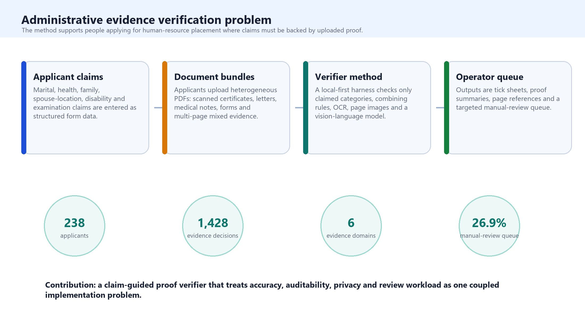
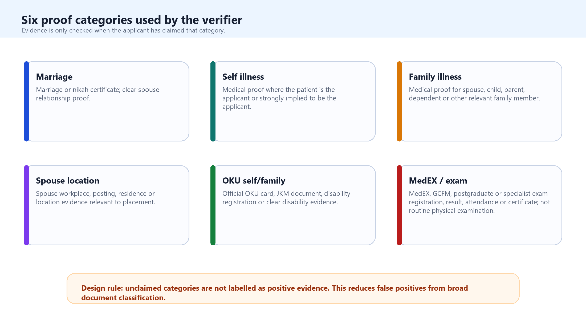
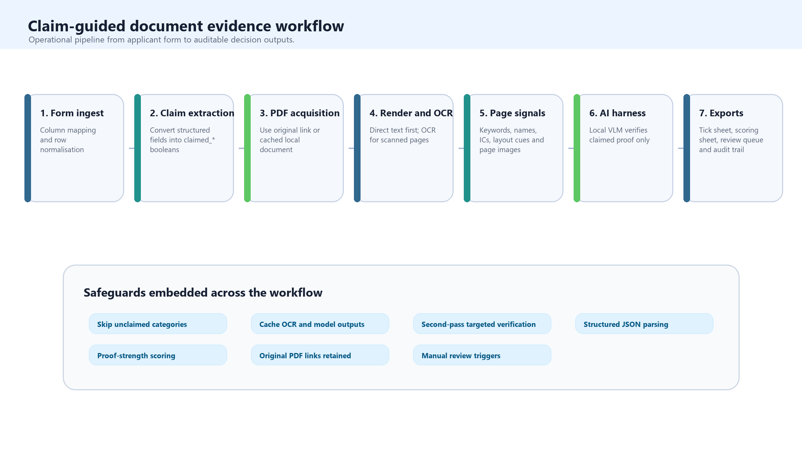
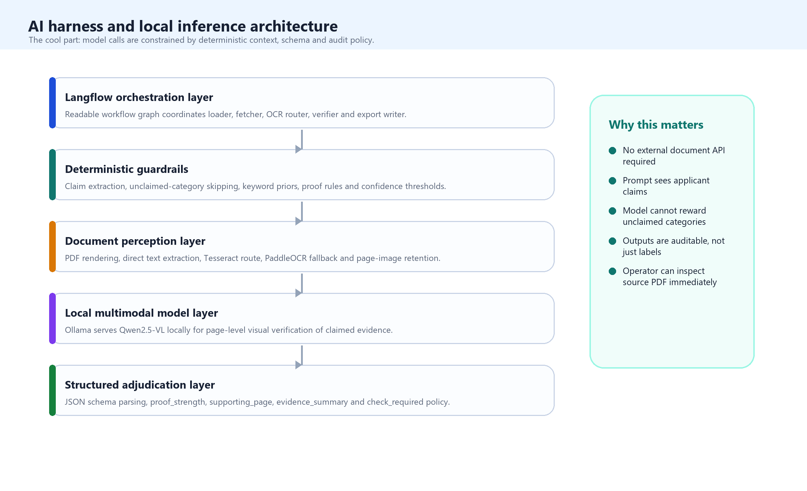
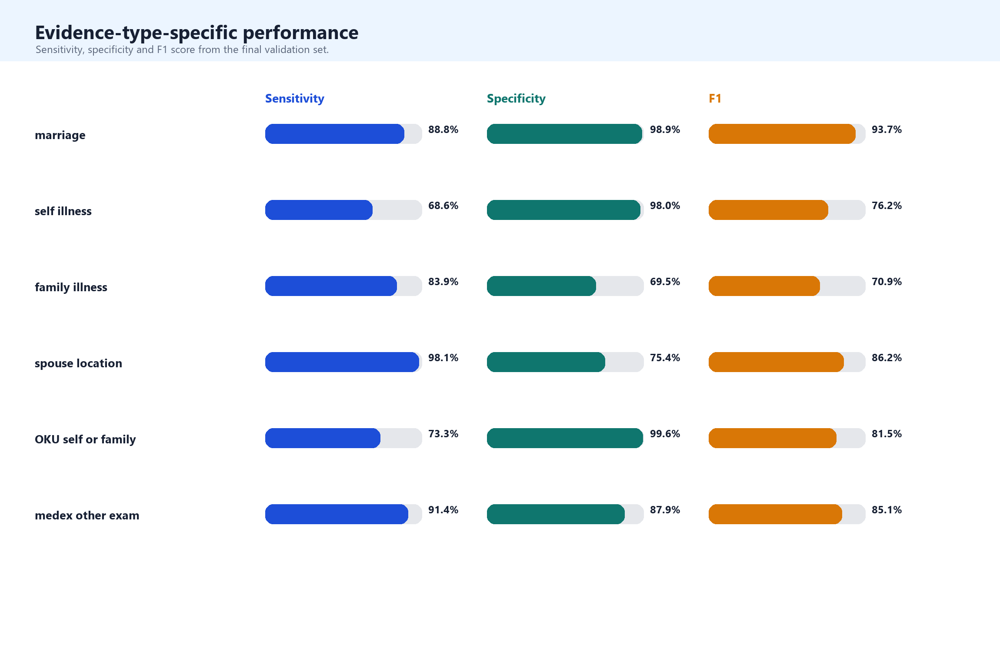
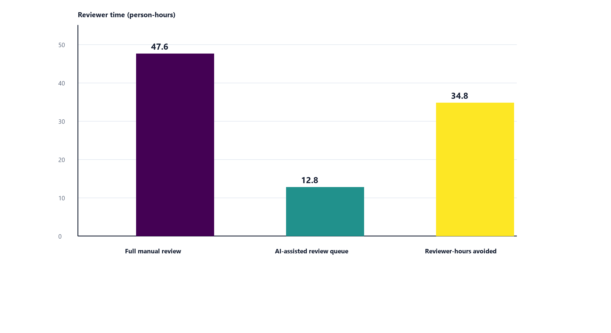

# Claim-guided document evidence verification for public-sector human-resource applications: development and evaluation of a local-first AI-assisted workflow

Draft author: Vivek Jason Jayaraj and collaborators
Draft date: 2026-05-07

## Abstract

Public-sector human-resource application systems often require people to support personal, family, health, disability, spouse-location and professional-training claims with documentary proof. This creates a recurrent administrative bottleneck: reviewers must reconcile structured form declarations with heterogeneous uploaded PDFs, many of which are scanned, multilingual, multi-page and only partly relevant. We developed a local-first, claim-guided document evidence verifier for this setting. The method first reads the applicant's declared claims, then verifies only those claimed evidence categories against the uploaded document bundle. The workflow combines deterministic claim extraction, direct PDF text extraction, optical character recognition (OCR), rendered page images, local vision-language model inference and structured proof-strength outputs within a human-in-the-loop review harness. Six proof categories were implemented: marriage, self illness, family illness, spouse location, OKU self or family, and MedEX or other examination evidence. In a retrospective validation set of 238 applicants and 1,428 applicant-evidence decisions, the verifier produced 415 true-positive, 103 false-positive, 856 true-negative and 54 false-negative decisions. Overall accuracy was 89.0%, sensitivity 88.5%, specificity 89.3%, positive predictive value 80.1%, negative predictive value 94.1% and F1 score 84.1%. The verifier routed 64 of 238 applicants (26.9%) for manual review, creating a first-pass no-check stream for 174 applicants (73.1%). The key contribution is not a single model, but an auditable AI-assisted workflow that constrains model interpretation using applicant claims, OCR-derived evidence, local multimodal inference and explicit human-review rules. The system should be understood as administrative decision support, not autonomous adjudication.

Keywords: document AI; human-resource applications; evidence verification; optical character recognition; vision-language model; local-first AI; human-in-the-loop; public-sector digital health

## Introduction

Large public-sector human-resource systems routinely ask applicants to provide documentary evidence for claims that affect placement, transfer, prioritisation or review. An applicant may declare that they are married, that a spouse is posted in a particular location, that they or a family member have health needs, that disability-related consideration applies, or that a postgraduate or professional examination obligation should be recognised. These claims are administratively consequential because they influence how a workforce system balances individual circumstances against service need. In health services, this sits within a wider policy challenge: sustaining fair and transparent workforce processes while distributing personnel across facilities and geographies in ways that protect service access [1,2].

The evidence-checking layer is often where the system slows down. The structured form may be legible, but the evidence bundle is rarely standardised. Applicants upload scanned marriage certificates, spouse posting letters, medical notes, hospital summaries, OKU cards, examination slips, screenshots and multi-document PDFs. Some pages have extractable text; others are image-only. Some documents are in English or Bahasa Malaysia; others contain Arabic-script or Jawi-like text, stamps, seals, tables, handwritten annotations and visual layouts that are meaningful to a human reviewer but poorly represented by OCR. Manual review is therefore still necessary, but it is repetitive, variable, difficult to scale and hard to audit consistently.

The methodological problem is not simply PDF classification. In this setting, the real question is whether the applicant uploaded sufficient proof for what they declared. A broad classifier that scans a PDF for all possible evidence categories can create false positives because it may identify plausible evidence that the applicant did not claim. Conversely, a conservative text-only pipeline can create false negatives when a visually obvious document is scanned poorly or has weak OCR. The method developed here addresses this by making the applicant claim the organising unit of verification. The verifier first determines what needs to be checked, and only then examines the document bundle for supporting evidence.

This work is adjacent to, but narrower than, full electronic know-your-customer or digital identity proofing. High-assurance e-KYC systems may include identity document authenticity checks, face matching, liveness detection, NFC or eMRTD chip validation, sanctions screening, device-risk signals and financial-crime risk scoring [3-5]. The present method does not attempt to perform that entire identity assurance stack. Its contribution is more specific: a local-first, auditable workflow for checking whether declared administrative claims are supported by uploaded documentary proof.

The document AI literature provides several relevant building blocks. Open-source OCR engines such as Tesseract remain widely used for text extraction [6], while PaddleOCR and the PP-OCR family provide lightweight multilingual OCR approaches [7,8]. Transformer-based document models, including TrOCR, LayoutLMv3, Donut and GeoLayoutLM, show how document understanding can combine text, layout and image information [9-12]. Vision-language models such as Qwen2.5-VL extend this further by enabling local or server-side interpretation of document images and page layouts [13]. However, administrative evidence verification requires more than a capable model. It requires a harness that tells the model what to verify, limits the opportunity for over-labelling, preserves source evidence, and returns structured outputs that a human reviewer can inspect.

We therefore report the development and retrospective evaluation of a claim-guided document evidence verifier. The objective was to build a method that could: (i) read applicant claims from structured data; (ii) inspect heterogeneous uploaded evidence; (iii) use OCR and local multimodal inference where useful; (iv) avoid labelling unclaimed categories as positive; and (v) produce auditable outputs for human review. Accuracy was measured as part of the method evaluation, but the primary contribution is the workflow design.

## Methods

### Study Setting and Design

We conducted a methods-development and retrospective evaluation study in a public-sector human-resource application context. The target users were operators reviewing applications from people who had entered structured form data and uploaded supporting PDFs. The method was developed for administrative proof checking rather than full identity proofing. The six target proof categories were marriage, self illness, family illness, spouse location, OKU self or family, and MedEX or other examination evidence. These categories were selected because they represent common forms of applicant-declared circumstances that require documentary substantiation.

Development was iterative and error-led. Early broad-classification prototypes treated the uploaded PDF as the primary object and attempted to infer all possible evidence categories from the document bundle. Error review showed that this approach was misaligned with the operational question because it could label plausible but unclaimed evidence. The final method therefore used claim-guided verification: the applicant row defined the claims to be checked, and unclaimed categories were skipped rather than classified.

### Claim-Guided Verifier

Each applicant row was normalised into six boolean claim fields. Marriage claims were derived from marital and spouse-related fields. Self-illness claims were derived from applicant health fields. Family-illness claims used spouse, child, parent or dependent health information. Spouse-location claims used spouse work, posting, residence or location fields. OKU claims used applicant or family disability indicators. MedEX or other examination claims used postgraduate, specialist-training or examination fields. When a row contained contradictory or unclear structured data, the verifier routed the applicant to manual review rather than silently forcing an interpretation.

The evidence definitions were deliberately operational. Marriage proof required a marriage or nikah certificate or similarly clear spouse-relationship evidence. Self-illness proof required medical evidence about the applicant. Family-illness proof required medical evidence about a spouse, child, parent, dependent or other relevant family member. Spouse-location proof required evidence of spouse workplace, posting, residence or location. OKU proof required explicit disability or OKU documentation. MedEX or other examination proof required official examination registration, attendance, result, certificate or postgraduate/specialist examination documentation; routine physical examination forms, ordinary medical check-ups and generic medical reports were not treated as examination evidence.

The verifier was implemented as a local-first pipeline. Applicant spreadsheets were ingested and mapped to canonical fields. The claim extractor converted each row into the six claim booleans. The document fetcher retrieved the uploaded PDF from the original link or from a local cache. The document processor extracted direct PDF text where available and rendered page images for scanned or visually important pages. OCR was used when direct text was absent, sparse or low quality. The evidence verifier then combined deterministic rules, page-level signals, OCR-derived text and local model inference to decide whether each claimed category was supported. The final output was a reviewer-facing decision table with proof status, proof strength, supporting page, evidence summary, confidence and manual-review status.

The OCR layer followed a direct-text-first principle to avoid unnecessary processing. If the PDF contained sufficient embedded text, that text was used directly. If not, pages were rendered as images and processed through OCR. Page-level metadata included page number, extracted text, OCR confidence where available, image path, keyword signals and candidate evidence matches. This metadata supported page shortlisting so that model calls focused on likely pages rather than scanning every page equally.

The AI harness was designed as a constrained verification layer rather than a free-form chatbot. Langflow-shaped orchestration made the processing path inspectable as modular components. Ollama served the local language and vision-language model endpoint, with Qwen2.5-VL used for page-level visual verification when image evidence was required [13-15]. The prompt supplied applicant context and explicitly instructed the model to verify only categories that the applicant had claimed. Model output was parsed into a fixed schema containing proof_found, proof_strength, supporting_page, evidence_summary and confidence. The decision policy marked applicants for manual review when proof was missing, ambiguous, low confidence or affected by download, rendering or OCR failure.

This harness design was central to the method. The deterministic layer defined what needed to be checked; OCR and page rendering defined what could be read or seen; the vision-language model interpreted ambiguous or OCR-poor evidence within a bounded task; the parser converted output into structured fields; and the reviewer interface preserved human oversight. This separation of responsibilities was intended to reduce both model overreach and opaque automation.

### Validation Analysis

The method was evaluated against a manually adjudicated validation workbook. The analytic set contained 238 matched applicants. Each applicant contributed six applicant-evidence decisions, producing 1,428 binary decisions. Manual adjudication defined whether each evidence category was present or absent. We calculated true positives, false positives, true negatives and false negatives at the evidence-decision level, followed by accuracy, sensitivity, specificity, positive predictive value, negative predictive value and F1 score. We also calculated exact applicant-level agreement, defined as all six evidence categories matching the manual reference standard for a given applicant, and the manual review rate, defined as the proportion of applicants routed to check. Because six evidence decisions were clustered within each applicant, these metrics are interpreted as descriptive evaluation statistics rather than independent observations.

### Governance and Privacy

The development workflow avoided committing raw applicant PDFs, OCR caches, local databases or applicant-level identifiable error sheets to source control. The manuscript artifacts contain aggregate validation tables only. The intended deployment posture is human-in-the-loop decision support. Before operational use, the method should be paired with access controls, retention rules, audit sampling, reviewer accountability and a clear policy that no adverse decision is made solely from the verifier output.

## Results

The developed method produced an operational verifier that could ingest structured applicant data, retrieve uploaded PDFs, process text and image documents, invoke local model inference within a constrained harness, and export auditable applicant-level outputs. The main development result was the shift from broad document classification to claim-guided proof verification. In practical terms, the verifier no longer asked "what is in this PDF?" It asked "does the uploaded evidence support the claims this applicant declared?" This changed the behaviour of the system by reducing the incentive to reward unclaimed categories and by making the review output more aligned with the administrative task.

The final validation set contained 238 applicants and 1,428 evidence-level decisions. The verifier produced 415 true positives, 103 false positives, 856 true negatives and 54 false negatives. Overall accuracy was 89.0%, sensitivity 88.5%, specificity 89.3%, positive predictive value 80.1%, negative predictive value 94.1% and F1 score 84.1%. Exact applicant-level agreement was 118 of 238 applicants (49.6%). The system routed 64 applicants (26.9%) for manual review and left 174 applicants (73.1%) in the no-check stream.

| Metric | Result |
| --- | ---: |
| Applicants matched | 238 |
| Evidence-level binary decisions | 1,428 |
| True positives | 415 |
| False positives | 103 |
| True negatives | 856 |
| False negatives | 54 |
| Accuracy | 89.0% |
| Sensitivity / recall | 88.5% |
| Specificity | 89.3% |
| PPV / precision | 80.1% |
| NPV | 94.1% |
| F1 score | 84.1% |
| Exact applicant-level matches | 118 / 238 (49.6%) |
| Applicants flagged for manual review | 64 / 238 (26.9%) |
| Applicants not flagged for manual review | 174 / 238 (73.1%) |

Performance varied by evidence category. Marriage evidence performed strongly, with sensitivity of 88.8%, specificity of 98.9%, positive predictive value of 99.2% and F1 score of 93.7%. MedEX or other examination evidence also performed well, with sensitivity of 91.4%, specificity of 87.9% and F1 score of 85.1%. These categories often have distinctive document structures, official titles or examination-specific vocabulary. Family illness and spouse-location evidence remained more difficult because they require relationship resolution, not merely document-type recognition. Family illness had sensitivity of 83.9% but specificity of 69.5%, while spouse location had sensitivity of 98.1% and specificity of 75.4%. This suggests that the verifier was effective at detecting possible relational evidence, but sometimes over-called documents where the relationship or purpose of the document was not sufficiently clear.

| Evidence type | Manual positives | AI positives | TP | FP | TN | FN |
| --- | ---: | ---: | ---: | ---: | ---: | ---: |
| Marriage | 143 | 128 | 127 | 1 | 94 | 16 |
| Self illness | 35 | 28 | 24 | 4 | 199 | 11 |
| Family illness | 87 | 119 | 73 | 46 | 105 | 14 |
| Spouse location | 108 | 138 | 106 | 32 | 98 | 2 |
| OKU self or family | 15 | 12 | 11 | 1 | 222 | 4 |
| MedEX or other exam | 81 | 93 | 74 | 19 | 138 | 7 |

| Evidence type | Accuracy | Sensitivity | Specificity | PPV | NPV | F1 |
| --- | ---: | ---: | ---: | ---: | ---: | ---: |
| Marriage | 92.9% | 88.8% | 98.9% | 99.2% | 85.5% | 93.7% |
| Self illness | 93.7% | 68.6% | 98.0% | 85.7% | 94.8% | 76.2% |
| Family illness | 74.8% | 83.9% | 69.5% | 61.3% | 88.2% | 70.9% |
| Spouse location | 85.7% | 98.1% | 75.4% | 76.8% | 98.0% | 86.2% |
| OKU self or family | 97.9% | 73.3% | 99.6% | 91.7% | 98.2% | 81.5% |
| MedEX or other exam | 89.1% | 91.4% | 87.9% | 79.6% | 95.2% | 85.1% |

The manual review flag created a smaller operational review queue, but it did not identify every residual error. Among applicants with at least one evidence-level error, 34 of 120 were flagged for review. Among applicants with at least one false negative, 25 of 48 were flagged. This distinction matters: check_required is a workflow-control signal, not a guarantee that all no-check records are error-free.

| Error or review group | Total | Flagged for review | Percentage flagged |
| --- | ---: | ---: | ---: |
| False-positive evidence decisions | 103 | 19 | 18.4% |
| False-negative evidence decisions | 54 | 29 | 53.7% |
| Applicants with at least one false positive | 92 | 18 | 19.6% |
| Applicants with at least one false negative | 48 | 25 | 52.1% |
| Applicants with any evidence-level error | 120 | 34 | 28.3% |
| All applicants | 238 | 64 | 26.9% |

## Discussion

We developed and evaluated a claim-guided, local-first document evidence verifier for public-sector human-resource applications. The system achieved strong evidence-level performance and reduced the manual review queue to 26.9% of applicants in the validation set. More importantly, it demonstrated a workflow architecture for a problem that is often treated too narrowly as document classification. The verifier makes applicant claims the unit of analysis, uses OCR and visual evidence selectively, constrains local model inference through prompts and schema, and produces outputs designed for human review rather than autonomous decision-making.

The key lesson is that the harness is the method. The local vision-language model provides visual reasoning, especially for scanned or OCR-poor pages, but the model is only one component of a controlled system. The surrounding workflow determines what the model sees, what it is allowed to decide, how output is parsed, and when uncertainty is escalated. This is consistent with healthcare AI reporting guidance, which increasingly emphasises human-AI interaction, workflow context, implementation details and decision-support boundaries rather than model performance alone [16-18].

The evidence-specific results are also informative. Marriage and examination-related proof performed well because these documents tend to have distinctive titles, official structures, registration numbers or terminology. Family illness and spouse-location proof were more difficult because they require relational interpretation. A document may clearly be medical, but the system must still determine whether the patient is the applicant, spouse, child, parent or another person. A letter may clearly mention a workplace, but the system must determine whether it relates to the spouse and whether it is relevant to placement. Future gains are therefore likely to come from better relationship extraction, name and identity matching, and more disciplined handling of ambiguous third-person documents rather than from simply changing the model.

The appropriate operational posture is AI-assisted triage. A no-check output should mean that the current verifier found sufficient first-pass evidence under current rules, not that the applicant record is beyond error. A check output should mean that human attention is required because proof is missing, ambiguous, low confidence or affected by process failure. A deployment model should include mandatory review of check records, periodic sampling of no-check records, evidence-type-specific monitoring, and recalibration after each application cycle. This is particularly important because the manual review flag did not capture all residual errors in the validation set.

This work should not be positioned as a full e-KYC system. It does not verify identity document authenticity, perform face matching, assess liveness, validate NFC chips, screen sanctions lists or detect deliberate forgery. Its contribution is narrower and more defensible: a transparent, local-first method for administrative claim-proof checking. That narrowness is useful because many public-sector workflows need exactly this kind of middle layer between fully manual review and high-assurance identity proofing.

The study has several strengths. It reports a functioning software workflow rather than a conceptual prototype, evaluates it against a manually adjudicated reference set, reports both evidence-level and applicant-level performance, and preserves an audit path for human reviewers. It also highlights residual error rather than hiding it behind aggregate accuracy. The limitations are equally important. The validation set came from one workflow and may not generalise to future cycles, other document mixes or poorer-quality scans. The manual reference standard may contain reviewer error. Evidence-level decisions are clustered within applicants, so conventional metrics understate uncertainty. The system does not authenticate documents, verify identity or detect fraud beyond inconsistency between claims and evidence. Finally, the current review flag is useful for workload management but is not yet a complete safety net.

Future work should focus on relationship resolution, calibration and governance. Technically, this means better spouse and dependent linkage, stricter page-level relation extraction, improved multilingual OCR routing, comparison with OCR-free document-understanding baselines, and systematic evaluation of alternative local vision-language models. Operationally, it means reviewer feedback loops, drift monitoring, sampling plans, model cards, data retention rules, access controls and a clear policy for how AI-assisted evidence review affects applicant decisions.

## Conclusion

We developed and evaluated a local-first, claim-guided AI-assisted document evidence verifier for public-sector human-resource applications. The method converts structured applicant claims into targeted proof-checking tasks, combines OCR and page-image processing with constrained local multimodal inference, and returns auditable outputs for human review. In a 238-applicant validation set, it achieved strong evidence-level performance and reduced the first-pass manual review queue. The system is best understood as administrative decision support: a way to make evidence review faster, more consistent and more inspectable while preserving human accountability for uncertain or consequential cases.

## Data and Code Availability

Aggregate validation tables, manuscript source and the manuscript builder are stored in the repository manuscript folder. Raw applicant PDFs, OCR caches, local databases and applicant-level identifiable error sheets are not committed and should remain subject to organisational governance and privacy controls.

## Author Contributions

VJJ: conceptualisation, methodology, software, formal analysis, validation interpretation and writing of the original draft. Additional collaborators: data curation, manual validation, governance review and critical revision. Author roles should be finalised before submission.

## Funding

To be completed before submission.

## Conflicts of Interest

The authors declare no competing interests. To be confirmed before submission.

## References

1. World Health Organization. Global strategy on human resources for health: Workforce 2030. Geneva: World Health Organization; 2016.
2. World Health Organization. Increasing access to health workers in remote and rural areas through improved retention: global policy recommendations. Geneva: World Health Organization; 2010.
3. Financial Action Task Force. Guidance on Digital Identity. Paris: FATF; 2020.
4. National Institute of Standards and Technology. Digital Identity Guidelines: Identity Proofing and Enrollment. NIST Special Publication 800-63A. Gaithersburg: NIST; latest revision.
5. International Civil Aviation Organization. Doc 9303: Machine Readable Travel Documents. Montreal: ICAO.
6. Smith R. An overview of the Tesseract OCR engine. Proceedings of the Ninth International Conference on Document Analysis and Recognition. 2007.
7. Du Y, Li C, Guo R, et al. PP-OCR: A practical ultra lightweight OCR system. arXiv:2009.09941. 2020.
8. Li C, Liu W, Guo R, et al. PP-OCRv3: More attempts for the improvement of ultra lightweight OCR system. arXiv:2206.03001. 2022.
9. Li M, Lv T, Chen J, et al. TrOCR: Transformer-based optical character recognition with pre-trained models. arXiv:2109.10282. 2021.
10. Huang Y, Lv T, Cui L, Lu Y, Wei F. LayoutLMv3: Pre-training for document AI with unified text and image masking. arXiv:2204.08387. 2022.
11. Kim G, Hong T, Yim M, et al. OCR-free Document Understanding Transformer. European Conference on Computer Vision. 2022.
12. Luo C, Li Y, Qiao L, et al. GeoLayoutLM: Geometric pre-training for visual information extraction. CVPR. 2023.
13. Qwen Team. Qwen2.5-VL Technical Report. arXiv:2502.13923. 2025.
14. Ollama. Ollama API documentation. Available from: https://docs.ollama.com/
15. Langflow. Langflow documentation. Available from: https://docs.langflow.org/
16. Vasey B, Nagendran M, Campbell B, et al. Reporting guideline for the early-stage clinical evaluation of decision support systems driven by artificial intelligence: DECIDE-AI. Nature Medicine. 2022;28:924-933.
17. Liu X, Rivera SC, Moher D, et al. Reporting guidelines for clinical trial reports for interventions involving artificial intelligence: the CONSORT-AI extension. Nature Medicine. 2020;26:1364-1374.
18. Collins GS, Dhiman P, Andaur Navarro CL, et al. TRIPOD+AI statement: updated guidance for reporting clinical prediction models that use regression or machine learning methods. BMJ. 2024;385:e078378.
19. Bossuyt PM, Reitsma JB, Bruns DE, et al. STARD 2015: an updated list of essential items for reporting diagnostic accuracy studies. BMJ. 2015;351:h5527.
20. Hevner AR, March ST, Park J, Ram S. Design science in information systems research. MIS Quarterly. 2004;28(1):75-105.
21. Mitchell M, Wu S, Zaldivar A, et al. Model cards for model reporting. Proceedings of the Conference on Fairness, Accountability, and Transparency. 2019.
22. Gebru T, Morgenstern J, Vecchione B, et al. Datasheets for datasets. Communications of the ACM. 2021;64(12):86-92.
23. Arlazarov VV, Bulatov K, Chernov TS, Arlazarov VL. MIDV-500: a dataset for identity document analysis and recognition on mobile devices in video stream. Computer Optics. 2019.
24. Bulatov K, Arlazarov VV, Chernov TS, Slavin O, Nikolaev D. MIDV-2020: a comprehensive benchmark dataset for identity document analysis. Computer Optics. 2021.
25. Shi Y, Jain AK. DocFace: matching ID document photos to selfies. IEEE International Joint Conference on Biometrics. 2018.
26. Yu Z, Qin Y, Zhao X, Li C, Zhao G. Searching central difference convolutional networks for face anti-spoofing. CVPR. 2020.
27. JMIR Publications. What are the article types for JMIR Publications journals? JMIR Publications Support. Accessed 2026-05-07.
